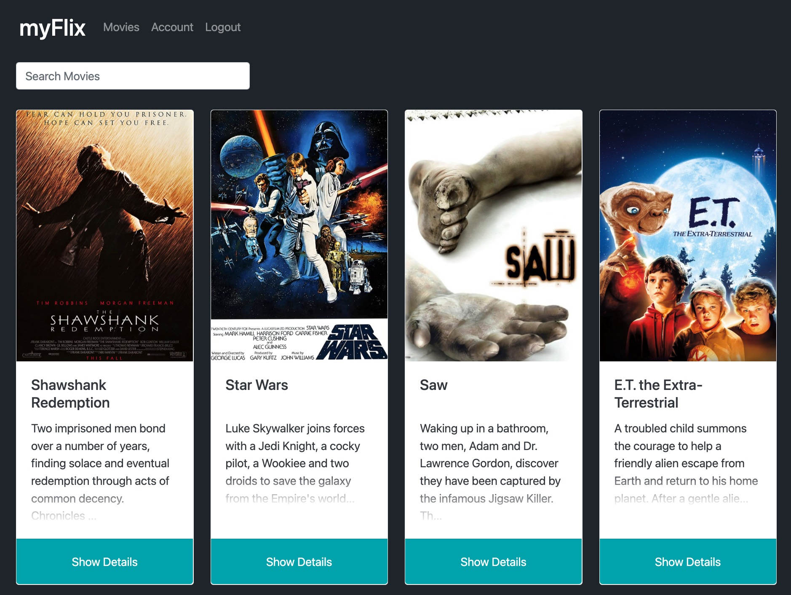

# 🎬 MyFlixDB 🎬

 

## Overview

Client-side of MyFlixDB, a movie database app which fetches data from it's server-side
(a mongoDB database with custom built API). Users register, login, update personal info, and search for and save information about movies, directors, and genres. They can also create a list of
their favorite movies, adding or removing movies at any time.

## Technical Features:

- Single-page application (SPA) built with React
- JWT Token Authentication prior to accessing features
- Accesses mongoDB using custom API
- React Redux is written using the React library and React Redux
- React Bootstrap as a UI library for styling and responsiveness
- State routing to navigate between views and share URLs
- Mix of class components and function components
- Users can filter movies
- Parcel for build tool

## Technologies:

- React
- Redux
- Node.js
- MongoDB
- Axios
- Express
- JWT Authentication
- React-Bootstrap
- HTML, CSS, JavaScript

## Views
### Login view

- Allows users to log in with a username and password

### Registration view

- Allows new users to register (username, password, email, birthday)

### Main view

- Returns a list of all movies to the user (each listed item with an image, title, and description)
- Search function
- Ability to select a movie for more details

### Single Movie view

- Returns data (image, title, release year, description, genre, director, actors) about a single movie to the user.
- Allows users to add a movie to their list of favorites
- Allow users to move to director and genre view

### Director view

- Returns data about a director's name, bio and birthday.
- Shows movies directed by that director

### Genre view

- Returns data about a genre, with a name and description.
- Shows other movies in the same genre

### Profile view

- Allows users to update their user info (username, password, email, date of birth)
- Allows existing users to deregister
- Displays user's favorite movies
- Allows users to remove a movie from their list of favorites

### Screenshot of the app:

  

---
